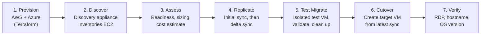
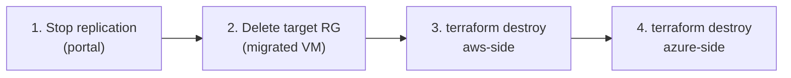

# Lab 06: AWS EC2 to Azure Migration with Azure Migrate


An end-to-end, cloud-to-cloud migration of a Windows Server 2022 instance from **AWS EC2** into **Azure** using **Azure Migrate**. Both cloud environments are provisioned with **Terraform**, and the migration follows the full real-world lifecycle: **discovery, assessment, replication, test migration, and cutover**.

---

## Table of Contents

- [Business Problem](#business-problem)
- [Architecture](#architecture)
- [Migration Workflow](#migration-workflow)
- [Key Concepts](#key-concepts)
- [Tech Stack](#tech-stack)
- [Repository Structure](#repository-structure)
- [Cost Estimate](#cost-estimate)
- [Prerequisites](#prerequisites)
- [Part 1: Build the AWS Source Environment](#part-1-build-the-aws-source-environment)
- [Part 2: Build the Azure Target Environment](#part-2-build-the-azure-target-environment)
- [Part 3: Deploy and Register the Discovery Appliance](#part-3-deploy-and-register-the-discovery-appliance)
- [Part 4: Assess the EC2 Instance](#part-4-assess-the-ec2-instance)
- [Part 5: Deploy the Replication Appliance and Replicate](#part-5-deploy-the-replication-appliance-and-replicate)
- [Part 6: Test Migration and Cutover](#part-6-test-migration-and-cutover)
- [Verification Checklist](#verification-checklist)
- [Troubleshooting](#troubleshooting)
- [Teardown](#teardown)
- [Security Considerations](#security-considerations)
- [Lessons Learned](#lessons-learned)

---

## Business Problem

Organizations move workloads between clouds for cost optimization, compliance, platform consolidation, or after acquiring a business that runs on a different provider. AWS to Azure migrations are a common, high-value engagement.

**Azure Migrate** is Microsoft's native migration hub. It discovers source servers, assesses their readiness and right-sizes them for Azure, replicates their disks continuously in the background, and performs a controlled cutover with minimal downtime.

**Outcome of this lab:** a Windows Server running in AWS was discovered, assessed as *Ready for Azure*, replicated, validated through a non-disruptive test migration, and cut over to a running Azure VM verified over RDP.

---

## Architecture


The numbered arrows follow the migration in order: discovery (1), assessment (2), replication (3), caching in storage with state tracked in the vault (4), test migration and cutover (5), and RDP verification (6). Terraform provisions both clouds from the engineer workstation. The target resource group's VM, public IP, and test VM are created during migration and sit outside Terraform state.

### Network Address Plan

| Environment | Network | CIDR | Purpose |
|---|---|---|---|
| AWS | `vpc-migrate-<name>` | `10.0.0.0/16` | Source network boundary |
| AWS | `snet-migrate-<name>` | `10.0.1.0/24` | Public subnet hosting the EC2 source |
| Azure | `vnet-migrate-<name>` | `10.1.0.0/16` | Staging and landing network |
| Azure | `snet-migrate` | `10.1.1.0/24` | Appliances and migrated VM |

The address spaces are intentionally **non-overlapping** so the two environments could later be connected by VPN or peering without readdressing.

---

## Migration Workflow



| Phase | What happens | Tool |
|---|---|---|
| Provision | Source (AWS) and target (Azure) infrastructure built as code | Terraform |
| Discover | Appliance collects OS, hardware, and performance data from the EC2 instance | Azure Migrate: Discovery and assessment |
| Assess | Readiness checks, VM size recommendation, monthly cost estimate | Azure Migrate: Discovery and assessment |
| Replicate | Disk data copied to Azure, then kept in sync with deltas | Azure Migrate: Migration and modernization (Azure Site Recovery) |
| Test migrate | Throwaway VM created from replicated disk to prove it boots | Azure Migrate |
| Cutover | Final sync, production VM created in the target resource group | Azure Migrate |

---

## Key Concepts

**Why two appliances?** For AWS (and other physical or non-VMware sources), Azure Migrate treats instances as physical servers and needs two separate Windows VMs in Azure:

| Appliance | Role |
|---|---|
| **Discovery appliance** | Inventories the source server and collects performance data used by the assessment |
| **Replication appliance** (Configuration Server) | Orchestrates disk-level replication using Azure Site Recovery and registers with the Recovery Services Vault |

This differs from VMware agentless migration, where no separate replication appliance is needed. For AWS sources, the replication appliance is always required, and replication relies on the **Mobility service** running on the source server.

**Why a storage account?** It is the **replication cache**. Disk data lands here first, then gets committed to a managed disk at cutover. It buffers continuous changes between delta sync cycles.

**Why a Recovery Services Vault?** Azure Migrate uses **Azure Site Recovery** under the hood, and Site Recovery stores replication policies, configuration, and state in the vault.

**Why separate source and target resource groups?** The staging infrastructure (appliances, cache, vault) can be torn down after cutover without touching the newly migrated production VM.

---

## Tech Stack

| Category | Tools |
|---|---|
| Infrastructure as Code | Terraform (`hashicorp/aws ~> 5.0`, `hashicorp/azurerm ~> 3.0`, `hashicorp/null`) |
| Source cloud | AWS EC2, VPC, Internet Gateway, Route Table, Security Group, IAM |
| Target cloud | Azure Migrate, Azure Site Recovery, Recovery Services Vault, Storage Account, Log Analytics, VNet, NSG, Windows VMs |
| CLIs | AWS CLI, Azure CLI, PowerShell |
| Access and validation | RDP (`mstsc` / Microsoft Remote Desktop), WinRM |

---

## Repository Structure

```text
aws-to-azure-migrate/
├── README.md
├── images/
│   └── lab06-architecture.svg # Architecture diagram
├── aws-side/
│   ├── main.tf                # VPC, IGW, subnet, routing, SG, IAM, EC2
│   ├── variables.tf
│   ├── outputs.tf
│   └── terraform.tfvars       # NOT committed (see .gitignore)
└── azure-side/
    ├── main.tf                # RGs, VNet, storage, LAW, RSV, NSG, appliance VMs
    ├── variables.tf
    ├── outputs.tf
    └── terraform.tfvars       # NOT committed (see .gitignore)
```

Recommended `.gitignore`:

```gitignore
**/.terraform/*
*.tfstate
*.tfstate.*
*.tfvars
crash.log
.terraform.lock.hcl
```

> `terraform.tfvars` contains passwords and `terraform.tfstate` contains the AWS secret access key in plain text. Never commit either.

---

## Cost Estimate

Paid resources run on **both** clouds. Approximate cost if the lab is completed and destroyed within one day:

| Resource | Estimated cost |
|---|---|
| EC2 t3.medium (Windows) | ~$0.08/hr (~$0.50 for 6 hrs) |
| Discovery appliance VM (Standard_D8s_v5) | ~$0.75/hr |
| Replication appliance VM (Standard_A4_v2) | ~$0.40/hr |
| Azure Storage (replication cache, ~30 GB) | ~$0.60/day |
| Target VM (Standard_B2s, post-cutover) | ~$0.05/hr |
| **Total for a full-day lab** | **~$7 to $12** |

> **Destroy everything as soon as the lab is complete.** See [Teardown](#teardown).

---

## Prerequisites

### Accounts

- An **Azure subscription** with Owner or Contributor + User Access Administrator rights
- An **AWS account** with an IAM user for Terraform (for example `terraform-migrate-lab`) that has `AmazonEC2FullAccess`, `AmazonVPCFullAccess`, and IAM permissions to create users, roles, and policies

### Tools

**macOS**

```bash
brew tap hashicorp/tap && brew install hashicorp/tap/terraform
brew install awscli azure-cli

aws configure        # Access Key ID, Secret, region us-east-1, output json
az login
az account set --subscription "<your-subscription-name-or-id>"
```

**Windows (PowerShell)**

```powershell
# Install Terraform:  https://developer.hashicorp.com/terraform/install
# Install AWS CLI:    https://aws.amazon.com/cli/
# Install Azure CLI:  https://aka.ms/installazurecliwindows

aws configure        # Access Key ID, Secret, region us-east-1, output json
az login
az account set --subscription "<your-subscription-name-or-id>"
```

Verify both CLIs before continuing:

```bash
aws sts get-caller-identity
az account show
```

### Folder setup

The lab uses **two separate Terraform roots** so each cloud can be deployed and destroyed independently.

```bash
# macOS / Linux
mkdir -p ~/aws-to-azure-migrate/{aws-side,azure-side}
cd ~/aws-to-azure-migrate
touch {aws-side,azure-side}/{main.tf,variables.tf,outputs.tf,terraform.tfvars}
```

```powershell
# Windows
New-Item -ItemType Directory -Path "$HOME\aws-to-azure-migrate\aws-side","$HOME\aws-to-azure-migrate\azure-side" -Force
cd "$HOME\aws-to-azure-migrate"
"main.tf","variables.tf","outputs.tf","terraform.tfvars" | ForEach-Object {
  New-Item -ItemType File "aws-side\$_","azure-side\$_" -Force
}
```

---

## Part 1: Build the AWS Source Environment

### 1A. `aws-side/variables.tf`

```hcl
variable "aws_region" {
  description = "AWS region for the source EC2 instance."
  type        = string
  default     = "us-east-1"
}

variable "yourname" {
  description = "Lowercase, no spaces. Used to make resource names unique."
  type        = string
}

variable "windows_ami" {
  description = "Windows Server 2022 Base AMI ID for the selected region."
  type        = string
}

variable "instance_type" {
  description = "t3.medium is the practical minimum for Windows Server."
  type        = string
  default     = "t3.medium"
}

variable "admin_password" {
  description = "Administrator password for the Windows instance."
  type        = string
  sensitive   = true
}
```

### 1B. `aws-side/terraform.tfvars`

Look up the current Windows Server 2022 AMI for your region (AMI IDs change over time):

```bash
aws ec2 describe-images --region us-east-1 --owners amazon \
  --filters "Name=name,Values=Windows_Server-2022-English-Full-Base-*" "Name=state,Values=available" \
  --query "sort_by(Images, &CreationDate)[-1].ImageId" --output text
```

```hcl
aws_region     = "us-east-1"
yourname       = "<yourname>"
windows_ami    = "<ami-id-from-command-above>"
admin_password = "<StrongPassword-12+chars>"
```

> The password must be 12+ characters with uppercase, lowercase, numbers, and symbols.

### 1C. `aws-side/main.tf`

```hcl
terraform {
  required_providers {
    aws = {
      source  = "hashicorp/aws"
      version = "~> 5.0"
    }
  }
}

provider "aws" {
  region = var.aws_region
}

# ---------------- Networking ----------------
resource "aws_vpc" "main" {
  cidr_block           = "10.0.0.0/16"
  enable_dns_hostnames = true
  enable_dns_support   = true
  tags = { Name = "vpc-migrate-${var.yourname}", project = "azure-migrate-lab" }
}

resource "aws_internet_gateway" "main" {
  vpc_id = aws_vpc.main.id
  tags   = { Name = "igw-migrate-${var.yourname}" }
}

resource "aws_subnet" "main" {
  vpc_id                  = aws_vpc.main.id
  cidr_block              = "10.0.1.0/24"
  availability_zone       = "${var.aws_region}a"
  map_public_ip_on_launch = true
  tags = { Name = "snet-migrate-${var.yourname}" }
}

resource "aws_route_table" "main" {
  vpc_id = aws_vpc.main.id
  route {
    cidr_block = "0.0.0.0/0"
    gateway_id = aws_internet_gateway.main.id
  }
  tags = { Name = "rt-migrate-${var.yourname}" }
}

resource "aws_route_table_association" "main" {
  subnet_id      = aws_subnet.main.id
  route_table_id = aws_route_table.main.id
}

# ---------------- Security Group ----------------
# Note: AWS reserves the "sg-" prefix, so the name must not start with it.
resource "aws_security_group" "source_vm" {
  name        = "migrate-source-sg-${var.yourname}"
  description = "Azure Migrate lab: HTTPS, RDP, WinRM"
  vpc_id      = aws_vpc.main.id

  ingress {
    description = "HTTPS for Azure Migrate communication"
    from_port   = 443
    to_port     = 443
    protocol    = "tcp"
    cidr_blocks = ["0.0.0.0/0"]
  }

  ingress {
    description = "RDP for admin access (restrict to your IP outside a lab)"
    from_port   = 3389
    to_port     = 3389
    protocol    = "tcp"
    cidr_blocks = ["0.0.0.0/0"]
  }

  ingress {
    description = "WinRM HTTP for Azure Migrate OS discovery"
    from_port   = 5985
    to_port     = 5985
    protocol    = "tcp"
    cidr_blocks = ["0.0.0.0/0"]
  }

  egress {
    description = "Allow all outbound"
    from_port   = 0
    to_port     = 0
    protocol    = "-1"
    cidr_blocks = ["0.0.0.0/0"]
  }

  tags = { Name = "migrate-source-sg-${var.yourname}" }
}

# ---------------- IAM ----------------
data "aws_iam_policy_document" "assume_role" {
  statement {
    effect = "Allow"
    principals {
      type        = "Service"
      identifiers = ["ec2.amazonaws.com"]
    }
    actions = ["sts:AssumeRole"]
  }
}

data "aws_iam_policy_document" "migrate_permissions" {
  statement {
    effect = "Allow"
    actions = [
      "ec2:DescribeInstances",
      "ec2:DescribeInstanceTypes",
      "ec2:DescribeVolumes",
      "ec2:DescribeSnapshots",
      "ec2:DescribeImages",
      "ec2:DescribeRegions",
      "ec2:DescribeTags",
      "ec2:CreateSnapshot",
      "ec2:DeleteSnapshot"
    ]
    resources = ["*"]
  }
}

resource "aws_iam_role" "migrate_role" {
  name               = "role-azure-migrate-${var.yourname}"
  assume_role_policy = data.aws_iam_policy_document.assume_role.json
  tags               = { project = "azure-migrate-lab" }
}

resource "aws_iam_policy" "migrate_policy" {
  name   = "policy-azure-migrate-${var.yourname}"
  policy = data.aws_iam_policy_document.migrate_permissions.json
}

resource "aws_iam_role_policy_attachment" "migrate_attach" {
  role       = aws_iam_role.migrate_role.name
  policy_arn = aws_iam_policy.migrate_policy.arn
}

resource "aws_iam_instance_profile" "migrate_profile" {
  name = "profile-azure-migrate-${var.yourname}"
  role = aws_iam_role.migrate_role.name
}

# Dedicated, least-privilege service account with static keys
resource "aws_iam_user" "migrate_user" {
  name = "svc-azure-migrate-${var.yourname}"
  tags = { project = "azure-migrate-lab" }
}

resource "aws_iam_user_policy_attachment" "migrate_user_policy" {
  user       = aws_iam_user.migrate_user.name
  policy_arn = aws_iam_policy.migrate_policy.arn
}

resource "aws_iam_access_key" "migrate_user_key" {
  user = aws_iam_user.migrate_user.name
}

# ---------------- Source EC2 Instance ----------------
resource "aws_instance" "source_vm" {
  ami                    = var.windows_ami
  instance_type          = var.instance_type
  subnet_id              = aws_subnet.main.id
  vpc_security_group_ids = [aws_security_group.source_vm.id]
  iam_instance_profile   = aws_iam_instance_profile.migrate_profile.name

  root_block_device {
    volume_type = "gp3"
    volume_size = 30
    encrypted   = false
  }

  # Sets the local Administrator password on first boot
  user_data = <<-EOF
    <powershell>
    net user Administrator "${var.admin_password}"
    </powershell>
  EOF

  volume_tags = { Name = "vol-migrate-source-${var.yourname}", project = "azure-migrate-lab" }
  tags        = { Name = "ec2-migrate-source-${var.yourname}", project = "azure-migrate-lab" }
}
```

**What each block does**

| Resource | Azure equivalent | Purpose |
|---|---|---|
| `aws_vpc` | VNet | Isolated network boundary; DNS hostnames enabled so the instance is identifiable |
| `aws_internet_gateway` + route table | Default internet route | Gives the subnet a path to the internet so Azure can reach the instance |
| `aws_security_group` | NSG | Stateful firewall: 443 (Migrate), 3389 (RDP), 5985 (WinRM discovery) |
| IAM user, policy, role | Service principal + RBAC | Least-privilege, read-mostly access scoped to EC2 describe and snapshot actions |
| `aws_instance` | Virtual machine | The Windows Server 2022 source that gets migrated |

### 1D. `aws-side/outputs.tf`

```hcl
output "ec2_instance_id"   { value = aws_instance.source_vm.id }
output "ec2_public_ip"     { value = aws_instance.source_vm.public_ip }
output "ec2_private_ip"    { value = aws_instance.source_vm.private_ip }
output "aws_region"        { value = var.aws_region }

output "migrate_access_key_id" {
  value = aws_iam_access_key.migrate_user_key.id
}

output "migrate_secret_access_key" {
  value     = aws_iam_access_key.migrate_user_key.secret
  sensitive = true
}
```

### 1E. Deploy

```bash
cd aws-side
terraform init
terraform plan
terraform apply
```

Expect **~10 resources**. Windows instances take several extra minutes to initialize, so wait about 5 minutes after `apply` before connecting.

Save these values for later:

```bash
terraform output ec2_public_ip
terraform output ec2_instance_id
terraform output migrate_access_key_id
terraform output -raw migrate_secret_access_key
```

### 1F. Verify the source

```powershell
# Windows
$ip = terraform output -raw ec2_public_ip
mstsc /v:$ip
```

On macOS, use **Microsoft Remote Desktop** with the public IP. Log in as `Administrator` with your `admin_password`. A Windows Server desktop confirms the source is ready.

---

## Part 2: Build the Azure Target Environment

### 2A. `azure-side/variables.tf`

```hcl
variable "yourname" {
  type = string
}

variable "location" {
  description = "Azure region. Choose one close to the AWS region."
  type        = string
  default     = "Central US"
}

variable "appliance_admin_password" {
  description = "Admin password for the discovery appliance VM."
  type        = string
  sensitive   = true
}

variable "replication_admin_password" {
  description = "Admin password for the replication appliance VM."
  type        = string
  sensitive   = true
}

variable "tags" {
  type = map(string)
  default = {
    project    = "azure-migrate-lab"
    managed_by = "terraform"
  }
}
```

### 2B. `azure-side/terraform.tfvars`

```hcl
yourname                   = "<yourname>"
location                   = "Central US"
appliance_admin_password   = "<StrongPassword>"
replication_admin_password = "<StrongPassword>"
```

### 2C. `azure-side/main.tf`

This file builds the staging and target infrastructure. The two appliance VMs are added in Parts 3 and 5, but you can include them from the start and deploy everything in one `apply`.

**Core `azure-side/main.tf`**

```hcl
terraform {
  required_providers {
    azurerm = {
      source  = "hashicorp/azurerm"
      version = "~> 3.0"
    }
    null = {
      source = "hashicorp/null"
    }
  }
}

provider "azurerm" {
  features {}
}

data "azurerm_client_config" "current" {}

# ---------------- Staging (source) resource group + network ----------------
resource "azurerm_resource_group" "source" {
  name     = "rg-migrate-source-${var.yourname}"
  location = var.location
  tags     = var.tags
}

resource "azurerm_virtual_network" "main" {
  name                = "vnet-migrate-${var.yourname}"
  location            = var.location
  resource_group_name = azurerm_resource_group.source.name
  address_space       = ["10.1.0.0/16"]
  tags                = var.tags
}

resource "azurerm_subnet" "main" {
  name                 = "snet-migrate"
  resource_group_name  = azurerm_resource_group.source.name
  virtual_network_name = azurerm_virtual_network.main.name
  address_prefixes     = ["10.1.1.0/24"]
}

# ---------------- Target resource group ----------------
resource "azurerm_resource_group" "target" {
  name     = "rg-migrate-target-${var.yourname}"
  location = var.location
  tags     = var.tags
}

# ---------------- Azure Migrate project (manual) ----------------
# azurerm has no azurerm_migrate_project resource. Create it in the portal:
#   Azure Migrate > Create project
#   Resource group: rg-migrate-source-<yourname>
#   Name: migrate-project-<yourname>   Geography: United States
resource "null_resource" "migrate_project_reminder" {
  triggers = {
    resource_group = azurerm_resource_group.source.name
  }
}

# ---------------- Replication cache ----------------
resource "azurerm_storage_account" "replication_cache" {
  name                     = "stmigrate${var.yourname}"   # 3-24 lowercase letters/digits, globally unique
  resource_group_name      = azurerm_resource_group.source.name
  location                 = var.location
  account_tier             = "Standard"
  account_replication_type = "LRS"
  account_kind             = "StorageV2"
  min_tls_version          = "TLS1_2"
  tags                     = var.tags
}

# ---------------- Log Analytics ----------------
resource "azurerm_log_analytics_workspace" "main" {
  name                = "law-migrate-${var.yourname}"
  location            = var.location
  resource_group_name = azurerm_resource_group.source.name
  sku                 = "PerGB2018"
  retention_in_days   = 30
  tags                = var.tags
}

# ---------------- Recovery Services Vault ----------------
resource "azurerm_recovery_services_vault" "main" {
  name                         = "rsv-migrate-${var.yourname}"
  location                     = var.location
  resource_group_name          = azurerm_resource_group.source.name
  sku                          = "Standard"
  soft_delete_enabled          = false   # lab only, so destroy works cleanly
  cross_region_restore_enabled = false
  tags                         = var.tags
}

# ---------------- NSG for the migrated VM ----------------
resource "azurerm_network_security_group" "target_vm" {
  name                = "nsg-migrate-target-${var.yourname}"
  location            = var.location
  resource_group_name = azurerm_resource_group.target.name

  security_rule {
    name                       = "allow-rdp"
    priority                   = 1000
    direction                  = "Inbound"
    access                     = "Allow"
    protocol                   = "Tcp"
    source_port_range          = "*"
    destination_port_range     = "3389"
    source_address_prefix      = "*"
    destination_address_prefix = "*"
  }

  tags = var.tags
}
```

**Design decisions**

| Setting | Value | Reason |
|---|---|---|
| VNet CIDR | `10.1.0.0/16` | No overlap with the AWS VPC |
| Storage replication | `LRS`, `Standard`, `StorageV2` | Temporary cache; Azure Migrate validates tier and kind |
| `soft_delete_enabled` | `false` | Allows a clean `terraform destroy`. Keep enabled in production |
| `cross_region_restore_enabled` | `false` | Migration lab, not a backup scenario |
| Migrate project | `null_resource` placeholder | The azurerm provider does not support Azure Migrate projects |

### 2D. `azure-side/outputs.tf`

```hcl
output "migrate_project_name"        { value = "migrate-project-${var.yourname} (create manually in portal)" }
output "source_resource_group"       { value = azurerm_resource_group.source.name }
output "target_resource_group"       { value = azurerm_resource_group.target.name }
output "replication_storage_account" { value = azurerm_storage_account.replication_cache.name }
output "recovery_services_vault"     { value = azurerm_recovery_services_vault.main.name }
output "vnet_name"                   { value = azurerm_virtual_network.main.name }
output "target_subnet_id"            { value = azurerm_subnet.main.id }

output "appliance_public_ip"             { value = azurerm_public_ip.appliance.ip_address }
output "replication_appliance_public_ip" { value = azurerm_public_ip.replication.ip_address }
```

> The last two outputs reference the appliance resources from Parts 3B and 5A. If you deploy in stages, add each output when you add its VM.

### 2E. Deploy

```bash
cd azure-side
terraform init
terraform plan
terraform apply
terraform output
```

### 2F. Create the Azure Migrate project (portal)

1. Search **Azure Migrate** and select **Create project**
2. Resource group: `rg-migrate-source-<yourname>`
3. Project name: `migrate-project-<yourname>`
4. Geography: **United States**
5. Select **Create**

---

## Part 3: Deploy and Register the Discovery Appliance

The discovery appliance bridges the AWS source and the Azure Migrate project. It runs on a dedicated Windows VM in Azure.

### 3A. Generate the project key

1. **Azure Migrate** > your project > **Servers, databases and web apps** > **Discover**
2. *Are your machines virtualized?* **Physical or other (AWS, GCP, Xen, etc.)**
3. *Where do you want to migrate to?* **Azure VM**
4. Name the appliance `appliance-migrate-<yourname>` and select **Generate key**
5. **Copy the project key** somewhere you can reach from inside the appliance VM
6. Download the appliance installer `.zip` (~1.5 GB)

> Lost the key? Azure Migrate > project > Discover > **Manage existing appliances**.

### 3B. Provision the discovery appliance VM (Terraform)

Microsoft's requirements for the physical-server discovery appliance are **8 vCPUs, 32 GB RAM, about 80 GB of disk, and Windows Server 2022 or 2025**. `Standard_D8s_v5` (8 vCPUs, 32 GiB) meets them and is a current-generation general-purpose size in Central US.

Confirm the size is offered to your subscription in Central US before you apply. An empty `Restrictions` column means you can deploy it:

```bash
az vm list-skus --location centralus --size Standard_D8s_v5 --resource-type virtualMachines --output table
```

> If the size is restricted or out of capacity, `Standard_D8as_v5` (AMD, same 8 vCPU / 32 GiB) is a drop-in alternative.

**Add to `azure-side/main.tf`**

```hcl
resource "azurerm_public_ip" "appliance" {
  name                = "pip-migrate-appliance-${var.yourname}"
  location            = var.location
  resource_group_name = azurerm_resource_group.source.name
  allocation_method   = "Static"
  sku                 = "Standard"
  tags                = var.tags
}

resource "azurerm_network_interface" "appliance" {
  name                = "nic-migrate-appliance-${var.yourname}"
  location            = var.location
  resource_group_name = azurerm_resource_group.source.name

  ip_configuration {
    name                          = "internal"
    subnet_id                     = azurerm_subnet.main.id
    private_ip_address_allocation = "Dynamic"
    public_ip_address_id          = azurerm_public_ip.appliance.id
  }

  tags = var.tags
}

resource "azurerm_network_security_group" "appliance" {
  name                = "nsg-migrate-appliance-${var.yourname}"
  location            = var.location
  resource_group_name = azurerm_resource_group.source.name

  security_rule {
    name                       = "allow-rdp"
    priority                   = 1000
    direction                  = "Inbound"
    access                     = "Allow"
    protocol                   = "Tcp"
    source_port_range          = "*"
    destination_port_range     = "3389"
    source_address_prefix      = "*"
    destination_address_prefix = "*"
  }

  tags = var.tags
}

resource "azurerm_network_interface_security_group_association" "appliance" {
  network_interface_id      = azurerm_network_interface.appliance.id
  network_security_group_id = azurerm_network_security_group.appliance.id
}

resource "azurerm_windows_virtual_machine" "appliance" {
  name                  = "vm-mig-appl-${var.yourname}"
  location              = var.location
  resource_group_name   = azurerm_resource_group.source.name
  size                  = "Standard_D8s_v5"
  admin_username        = "migrateadmin"
  admin_password        = var.appliance_admin_password
  network_interface_ids = [azurerm_network_interface.appliance.id]

  os_disk {
    caching              = "ReadWrite"
    storage_account_type = "Standard_LRS"
    disk_size_gb         = 80
  }

  source_image_reference {
    publisher = "MicrosoftWindowsServer"
    offer     = "WindowsServer"
    sku       = "2022-Datacenter"
    version   = "latest"
  }

  tags = var.tags
}
```

```bash
terraform apply
terraform output appliance_public_ip
```

### 3C. Install and register the appliance

1. RDP to `appliance_public_ip` as `migrateadmin`
2. Download the installer inside the session, then **Extract All** (do not run from inside the zip)
3. Right-click `AzureMigrateInstaller.ps1` > **Run with PowerShell** (as Administrator) and answer:

| Prompt | Answer |
|---|---|
| Change execution policy? | `Y` |
| Select scenario | `3` (Physical or other: AWS, GCP, Xen, etc.) |
| Select cloud | `1` (Azure Public) |
| Select connectivity | `1` (Public endpoint) |
| Continue with deployment? | `Y` |

4. Installation takes a few minutes, then the **appliance configuration manager** opens in a browser
5. **Set up prerequisites**: connectivity, time sync, and service checks should all pass
6. **Register with Azure Migrate**: paste the project key, select **Login**, and sign in
7. Confirm **Successfully registered**

### 3D. Add credentials and the discovery source

In the configuration manager:

1. **Add credentials**
   - Source type: **Windows Server**
   - Friendly name: `ec2winadmin` (letters and digits only)
   - Username: `Administrator`
   - Password: `admin_password` from `aws-side/terraform.tfvars`
2. Turn **off** the HTTPS slider so WinRM can use HTTP on port **5985**
3. **Add discovery source**: enter the EC2 **public IP** (there is no VPN, so the private IP is unreachable) and map it to `ec2winadmin`
4. **Save** > **Revalidate** and wait for **Validation successful**
5. **Start discovery**

Discovery takes **5 to 15 minutes**. The instance then appears in the project's discovered servers.

---

## Part 4: Assess the EC2 Instance

### 4A. Create the assessment

1. Azure Migrate > project > **Assess** > **Azure VM**
2. Assessment settings:

| Setting | Value |
|---|---|
| Target location | Central US |
| Storage type | Automatic |
| Sizing criteria | Performance-based |
| Reserved instances | None |

3. Create a group named `aws-ec2-group` and add `ec2-migrate-source-<yourname>`
4. **Review + create assessment**

### 4B. Review results

| Output | Expected result |
|---|---|
| Azure readiness | **Ready for Azure** |
| Recommended size | Likely `Standard_B2s` for a lightly loaded t3.medium |
| Monthly cost estimate | Projected Azure run cost |

> **Ready for Azure** means no blockers were found in OS version, boot type, disk count, or network configuration. *Ready with conditions* or *Not ready* surfaces specific remediation items, which is the most valuable output of this phase in real projects.

> Skip **Create wave**. Wave planning is for coordinating dozens or hundreds of servers. It adds nothing for a single-server migration.

---

## Part 5: Deploy the Replication Appliance and Replicate

### 5A. Provision the replication appliance VM (Terraform)

> **Must be Windows Server 2022.** The installer fails on 2019.

**Add to `azure-side/main.tf`**

```hcl
resource "azurerm_public_ip" "replication" {
  name                = "pip-migrate-repl-${var.yourname}"
  location            = var.location
  resource_group_name = azurerm_resource_group.source.name
  allocation_method   = "Static"
  sku                 = "Standard"
  tags                = var.tags
}

resource "azurerm_network_interface" "replication" {
  name                = "nic-migrate-repl-${var.yourname}"
  location            = var.location
  resource_group_name = azurerm_resource_group.source.name

  ip_configuration {
    name                          = "internal"
    subnet_id                     = azurerm_subnet.main.id
    private_ip_address_allocation = "Dynamic"
    public_ip_address_id          = azurerm_public_ip.replication.id
  }

  tags = var.tags
}

resource "azurerm_network_security_group" "replication" {
  name                = "nsg-migrate-repl-${var.yourname}"
  location            = var.location
  resource_group_name = azurerm_resource_group.source.name

  security_rule {
    name                       = "allow-rdp"
    priority                   = 1000
    direction                  = "Inbound"
    access                     = "Allow"
    protocol                   = "Tcp"
    source_port_range          = "*"
    destination_port_range     = "3389"
    source_address_prefix      = "*"
    destination_address_prefix = "*"
  }

  security_rule {
    name                       = "allow-https-inbound"
    priority                   = 1010
    direction                  = "Inbound"
    access                     = "Allow"
    protocol                   = "Tcp"
    source_port_range          = "*"
    destination_port_range     = "443"
    source_address_prefix      = "*"
    destination_address_prefix = "*"
  }

  security_rule {
    name                       = "allow-replication-data"
    priority                   = 1020
    direction                  = "Inbound"
    access                     = "Allow"
    protocol                   = "Tcp"
    source_port_range          = "*"
    destination_port_range     = "9443"
    source_address_prefix      = "*"
    destination_address_prefix = "*"
  }

  tags = var.tags
}

resource "azurerm_network_interface_security_group_association" "replication" {
  network_interface_id      = azurerm_network_interface.replication.id
  network_security_group_id = azurerm_network_security_group.replication.id
}

resource "azurerm_windows_virtual_machine" "replication" {
  name                  = "vm-mig-repl-${var.yourname}"
  computer_name         = "repl-${var.yourname}"
  location              = var.location
  resource_group_name   = azurerm_resource_group.source.name
  size                  = "Standard_A4_v2"
  admin_username        = "replicationadmin"
  admin_password        = var.replication_admin_password
  network_interface_ids = [azurerm_network_interface.replication.id]

  os_disk {
    caching              = "ReadWrite"
    storage_account_type = "Standard_LRS"
    disk_size_gb         = 127
  }

  source_image_reference {
    publisher = "MicrosoftWindowsServer"
    offer     = "WindowsServer"
    sku       = "2022-Datacenter"   # 2019 fails during installation
    version   = "latest"
  }

  tags = var.tags
}
```

```bash
terraform apply
terraform output replication_appliance_public_ip
```

### 5B. Install and register the replication appliance

1. RDP to `replication_appliance_public_ip` as `replicationadmin`
2. In the portal (inside the session): Azure Migrate > **Migration and modernization** > **Discover**
3. Select **Azure VM**, **Physical or other**, target region **Central US**, confirm, and **Create resources**
4. Download the replication appliance installer, extract it, and run `DRInstaller.ps1` as Administrator
5. In the configuration manager, register the appliance with `rsv-migrate-<yourname>` and your subscription
6. Once registered, the appliance appears in the **Replicate** wizard dropdown

### 5C. Enable replication

Azure Migrate > **Migration and modernization** > **Replicate**:

| Wizard step | Setting |
|---|---|
| Source | Physical or other (AWS, GCP, Xen, etc.) |
| Appliance | The registered replication appliance |
| Virtual machines | `ec2-migrate-source-<yourname>` |
| Resource group | `rg-migrate-target-<yourname>` |
| Replication storage account | `stmigrate<yourname>` |
| Virtual network / subnet | `vnet-migrate-<yourname>` / `snet-migrate` |
| Compute | Accept recommended size, OS type **Windows** |
| Disks | Defaults |
| Tags | `project = azure-migrate-lab` |

Select **Replicate**. Initial replication of a 30 GB disk typically takes **30 to 45 minutes**.

### 5D. Monitor progress

Azure Migrate > Migration and modernization > **Replicating machines**

```text
Initial replication in progress  -->  Protected
```

Do not proceed until the status shows **Protected**. Select the machine to view percent synced, data uploaded, and warnings.

---

## Part 6: Test Migration and Cutover

### 6A. Test migration (non-disruptive)

A test migration builds a temporary VM from the replicated disk so you can prove it boots before committing. Skipping this step is high risk in any real migration.

1. Replicating machines > your instance > **Test migration**
2. Select `vnet-migrate-<yourname>` and start the test
3. When the test VM appears in the target resource group, connect and confirm the desktop and system information match the source
4. Back in Azure Migrate, select **Clean up test migration**

### 6B. Cutover

1. Replicating machines > your instance > **Migrate**
2. *Shut down machines before migration?* **No** (lab only. In production, shut down the source to prevent split-brain)
3. Select **Migrate**

Azure performs a final sync and creates the production VM in `rg-migrate-target-<yourname>` (5 to 10 minutes).

### 6C. Verify the migrated VM

Attach a public IP and the target NSG, then connect:

**macOS / Linux**

```bash
RG=rg-migrate-target-<yourname>
NIC=$(az network nic list -g $RG --query "[0].name" -o tsv)
IPCFG=$(az network nic ip-config list -g $RG --nic-name $NIC --query "[0].name" -o tsv)

az network public-ip create -g $RG -n pip-migrated-vm --sku Standard
az network nic ip-config update -g $RG --nic-name $NIC -n $IPCFG --public-ip-address pip-migrated-vm
az network nic update -g $RG -n $NIC --network-security-group nsg-migrate-target-<yourname>

az network public-ip show -g $RG -n pip-migrated-vm --query ipAddress -o tsv
```

**Windows (PowerShell)**

```powershell
$RG    = "rg-migrate-target-<yourname>"
$NIC   = az network nic list -g $RG --query "[0].name" -o tsv
$IPCFG = az network nic ip-config list -g $RG --nic-name $NIC --query "[0].name" -o tsv

az network public-ip create -g $RG -n pip-migrated-vm --sku Standard
az network nic ip-config update -g $RG --nic-name $NIC -n $IPCFG --public-ip-address pip-migrated-vm
az network nic update -g $RG -n $NIC --network-security-group nsg-migrate-target-<yourname>

$ip = az network public-ip show -g $RG -n pip-migrated-vm --query ipAddress -o tsv
mstsc /v:$ip
```

Log in as `Administrator` with the **original AWS** `admin_password`. Confirm:

- The Windows Server desktop loads
- The hostname matches the original EC2 instance
- System properties show the same OS version

**Migration complete.**

---

## Verification Checklist

- [ ] EC2 instance running in the AWS console
- [ ] Azure Migrate project exists with the discovery appliance registered
- [ ] EC2 instance appears in discovered servers
- [ ] Assessment shows **Ready for Azure**
- [ ] Replication appliance registered with the Recovery Services Vault
- [ ] Replication status shows **Protected**
- [ ] Test migration succeeded and was cleaned up
- [ ] Cutover completed and the VM exists in the target resource group
- [ ] RDP to the migrated VM succeeds with the original credentials
- [ ] Hostname and OS version match the source

---

## Troubleshooting

| Symptom | Cause | Resolution |
|---|---|---|
| `invalid value for name (cannot begin with sg-)` | AWS reserves the `sg-` prefix for system IDs | Name the group `migrate-source-sg-<name>` |
| `collecting instance settings: empty result` | AMI ID is not valid in the selected region | Look up the current AMI with `aws ec2 describe-images` (Part 1B) |
| `provider does not support resource type azurerm_migrate_project` | azurerm has no Migrate project resource | Use a `null_resource` placeholder, add the `null` provider, run `terraform init`, and create the project in the portal |
| Discovery validation fails | WinRM blocked or wrong credentials | Confirm port 5985 is open in the AWS security group, HTTPS slider is off, and the `ec2winadmin` password is correct |
| Discovery shows 0 servers | Private IP used, or validation never succeeded | Use the EC2 **public** IP and revalidate |
| Replication appliance install fails | Unsupported OS | Rebuild the VM on Windows Server **2022** |
| Replication stuck at 0% | Cache storage or appliance connectivity | Verify `stmigrate<name>` is in the same subscription and region, and the appliance NSG allows 443 and 9443 |
| Assessment shows *Not ready* | Unsupported OS or configuration | Use Windows Server 2012 R2 or later (2022 always passes) |
| RDP to migrated VM fails | No public IP or NSG on the NIC | Attach `pip-migrated-vm` and `nsg-migrate-target-<name>` (Part 6C) |
| Migrated VM has a different IP | DHCP assigns a new Azure address | Expected when changing clouds. Update DNS records accordingly |
| `vault is not empty` on destroy | Replicated items still registered | Remove replication items from the vault in the portal, then retry |

---

## Teardown

Destroy in this order to avoid dependency errors.



**1. Stop replication** (if still active): Azure Migrate > Replicating machines > **Stop replication**. Wait for confirmation.

**2. Delete the target resource group.** It contains the migrated VM, disks, and public IP that Terraform does not manage, which would otherwise block `terraform destroy`.

```bash
az group delete --name rg-migrate-target-<yourname> --yes
```

**3. Destroy AWS resources**

```bash
cd aws-side
terraform destroy
```

**4. Destroy Azure resources** (includes both appliance VMs, the vault, storage, and networking)

```bash
cd azure-side
terraform destroy
```

**5. Clean up manual items:** delete the Azure Migrate project in the portal if it remains.

> If the vault fails to delete, remove all **Replicated items** and **Backup items** from `rsv-migrate-<yourname>` in the portal, then rerun `terraform destroy`.

---

## Security Considerations

This is a short-lived lab. The table below shows what was simplified and how it should be done in production.

| Lab shortcut | Production practice |
|---|---|
| RDP, WinRM, and HTTPS open to `0.0.0.0/0` | Restrict to known IPs, or use Azure Bastion / AWS Systems Manager |
| Migration traffic over public IPs | Site-to-site VPN or ExpressRoute / Direct Connect with private endpoints |
| Passwords in `terraform.tfvars` and EC2 `user_data` | Azure Key Vault / AWS Secrets Manager, never stored in source control |
| Static IAM access keys in Terraform state | Remote encrypted state backend, short key lifetime, rotate and delete after migration |
| EBS root volume unencrypted | Encrypt EBS volumes; use encryption at rest on Azure managed disks |
| Vault soft delete disabled | Keep soft delete enabled |
| Source left running at cutover | Shut down the source to prevent split-brain |

**Least privilege applied:** the AWS IAM policy is scoped to EC2 describe and snapshot actions only, with snapshot write actions limited to temporary snapshot creation and deletion.

---

## Lessons Learned

- **Azure Migrate treats AWS as "physical."** AWS instances follow the physical server path, which means OS-level discovery over WinRM and a dedicated replication appliance, not the VMware agentless flow.
- **Not everything is Terraform-able.** The Migrate project and appliance registration are portal-driven. A `null_resource` documents the manual step inside the IaC so the gap is visible.
- **Provider and platform quirks matter.** The reserved `sg-` prefix, region-specific AMI IDs, and the Windows Server 2022 requirement for the replication appliance each caused a failed run before being resolved.
- **Assessment is the real value phase.** Readiness and right-sizing drive cost and risk decisions before a single byte is replicated.
- **Always test migrate before cutover.** It proves bootability with zero impact on the source.
- **Plan teardown dependencies.** Resources created by the migration (the target VM) live outside Terraform state and must be removed first.
